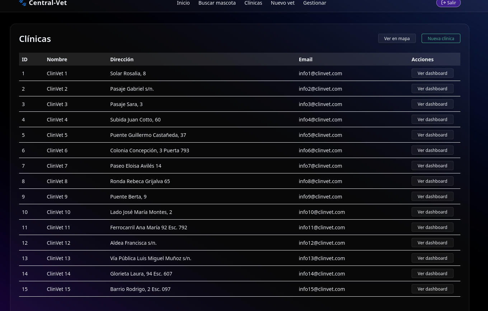

# 🐶 Veterinaria React + Spring Boot + Keycloak + AI Disease Prediction

## 👨‍💻 Developed by Jorge Guillermo Olarte Quispe  
## 🏫 Universidad Nacional del Altiplano – Ingeniería de Sistemas

A full-stack veterinary management system that empowers veterinarians, pet owners, and clinic administrators — built with a modular microservices approach and enhanced by AI and biometric login technologies.

---

### 🔧 Tech Stack Overview

- 🧠 **Frontend**: [React + TypeScript (Vite)](https://github.com/ArtStyle19/veterinaria-react-keycloak)
- 🏥 **Backend**: [Spring Boot REST API](https://github.com/ArtStyle19/veterinaria-springboot-keycloak)
- 🔐 **Authentication**: [Keycloak + Custom SPI for Facial Recognition](https://github.com/ArtStyle19/facial-spi-keycloak)
- 🧬 **Facial Recognition Engine**: [DeepFace (Facenet512 + RetinaFace) via GPU-accelerated Docker](https://github.com/ArtStyle19/docker-gpu-deepface)
- 🧠 **AI Disease Prediction**: Integrated via internal Flask microservice (Private Repo)
- 🗃️ **Database**: PostgreSQL

---

### 🚀 Core Features

- 👨‍⚕️ **Vet Dashboard**: Manage pet records, view historical data, and access AI-based diagnostic suggestions
- 👤 **Owner Portal**: Register pets, view records, and track medical history
- 🔐 **Facial Biometric Login**: Secure authentication using DeepFace-powered facial recognition via custom Keycloak SPI
- 🧬 **AI Disease Prediction**: Suggest potential conditions based on input symptoms (Flask model integration)
- 🗂️ **Admin Tools**: Approve new vets, manage clinics, monitor platform activity
- 📍 **QR Pet Status**: Quickly identify pets as “Lost” or “OK” by scanning a generated QR code
- 📱 **QR Import**: Easily **import pets via QR** (by vets or owners) to **grant read/write access to their medical record**

---

### 🔗 Related Repositories

| Project | Description | Link |
|--------|-------------|------|
| 🧩 **Frontend (React)** | Client-side pet management system with facial login | [veterinaria-react-keycloak](https://github.com/ArtStyle19/veterinaria-react-keycloak) |
| ⚙️ **Backend (Spring Boot)** | REST API for clinics, pets, and user roles | [veterinaria-springboot-keycloak](https://github.com/ArtStyle19/veterinaria-springboot-keycloak) |
| 🧠 **Keycloak SPI (Facial Auth)** | Facial login integration using DeepFace | [facial-spi-keycloak](https://github.com/ArtStyle19/facial-spi-keycloak) |
| 🐳 **GPU-Powered DeepFace Server** | Containerized deep learning backend for facial recognition | [docker-gpu-deepface](https://github.com/ArtStyle19/docker-gpu-deepface) |

> 🧪 **AI Disease Prediction Module**: Currently implemented internally via Flask, (Private Repo)

---

### 🗂️ Database Diagram

### 🧑‍⚕️ Vet Registration

### 🔐 Login and Security

### 👩‍⚕️ Vet Views

### 👩‍⚕️ Disease Prediction

### 👤 Owner Views

### 🐾 Pet Detail Status (QR)

### 🗺️ Clinics Map

### 📊 Admin Views

### 🧬 Pet Import Modals

