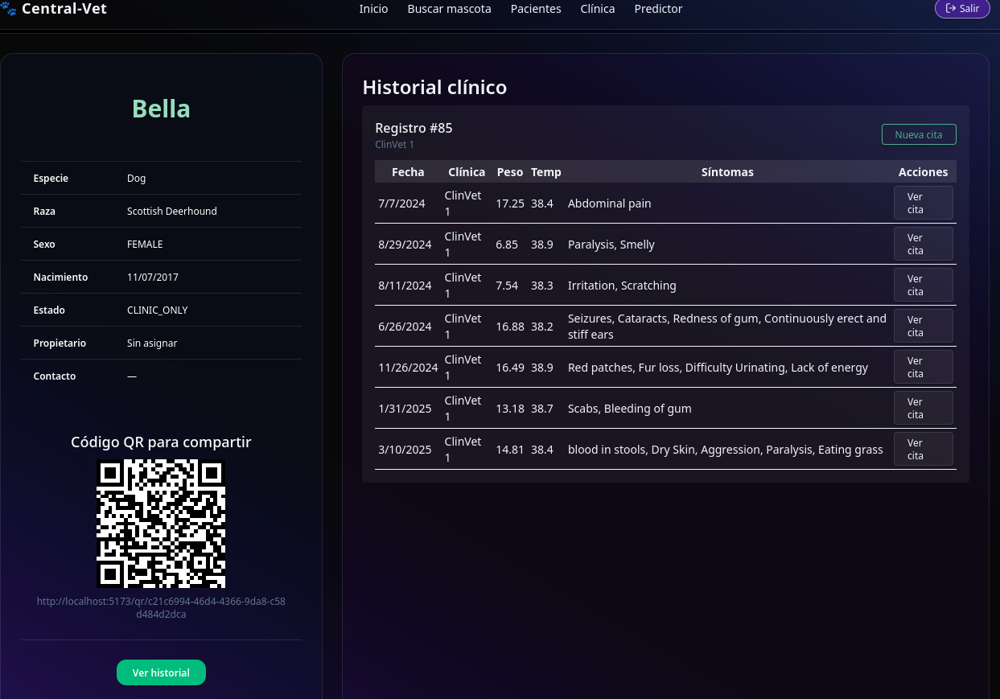
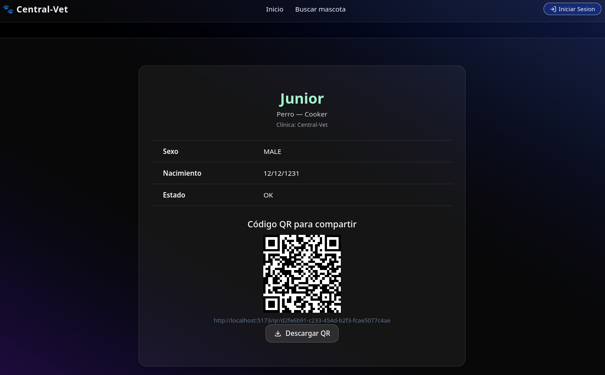

# Veterinaria React + Spring Boot + Keycloak + AI Disease Prediction

## Developed by Jorge Guillermo Olarte Quispe

## Universidad Nacional del Altiplano – Ingeniería de Sistemas

A full-stack veterinary management system that empowers veterinarians, pet owners, and clinic administrators — built with a modular microservices approach and enhanced by AI and biometric login technologies.

---

### Tech Stack Overview

- **Frontend**: [React + TypeScript (Vite)](https://github.com/ArtStyle19/veterinaria-react-keycloak)
- **Backend**: [Spring Boot REST API](https://github.com/ArtStyle19/veterinaria-springboot-keycloak)
- **Authentication**: [Keycloak + Custom SPI for Facial Recognition](https://github.com/ArtStyle19/facial-spi-keycloak)
- **Facial Recognition Engine**: [DeepFace (Facenet512 + RetinaFace) via GPU-accelerated Docker](https://github.com/ArtStyle19/docker-gpu-deepface)
- **AI Disease Prediction**: Integrated via internal Flask microservice (Private Repo)
- **Database**: PostgreSQL

---

### Core Features

- **Vet Dashboard**: Manage pet records, view historical data, and access AI-based diagnostic suggestions
- **Owner Portal**: Register pets, view records, and track medical history
- **Facial Biometric Login**: Secure authentication using DeepFace-powered facial recognition via custom Keycloak SPI
- **AI Disease Prediction**: Suggest potential conditions based on input symptoms (Flask model integration)
- **Admin Tools**: Approve new vets, manage clinics, monitor platform activity
- **QR Pet Status**: Quickly identify pets as “Lost” or “OK” by scanning a generated QR code
- **QR Import**: Easily import pets via QR (by vets or owners) to grant read/write access to their medical record

---

### Related Repositories

| Project                         | Description                                                | Link                                                                                             |
| ------------------------------- | ---------------------------------------------------------- | ------------------------------------------------------------------------------------------------ |
| **Frontend (React)**            | Client-side pet management system with facial login        | [veterinaria-react-keycloak](https://github.com/ArtStyle19/veterinaria-react-keycloak)           |
| **Backend (Spring Boot)**       | REST API for clinics, pets, and user roles                 | [veterinaria-springboot-keycloak](https://github.com/ArtStyle19/veterinaria-springboot-keycloak) |
| **Keycloak SPI (Facial Auth)**  | Facial login integration using DeepFace                    | [facial-spi-keycloak](https://github.com/ArtStyle19/facial-spi-keycloak)                         |
| **GPU-Powered DeepFace Server** | Containerized deep learning backend for facial recognition | [docker-gpu-deepface](https://github.com/ArtStyle19/docker-gpu-deepface)                         |

> **AI Disease Prediction Module**: Currently implemented internally via Flask, (Private Repo)

---

### Database Diagram

### Vet Registration

### Login and Security

### Vet Views

### Disease Prediction

### Owner Views

### Pet Detail Status (QR)

### Clinics Map

### Admin Views

### Pet Import Modals

